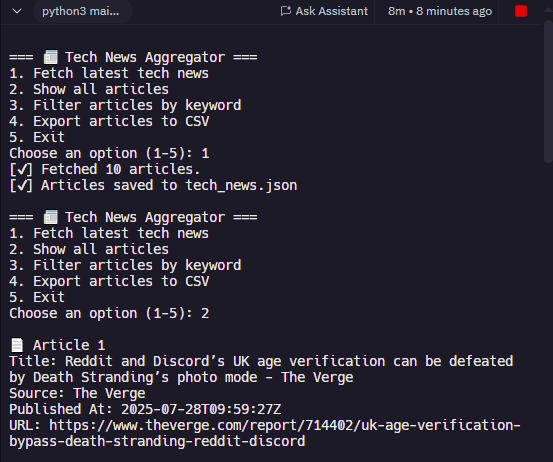

# 📰 Tech News Aggregator

A lightweight, command-line Python app that fetches and filters the latest technology headlines using NewsAPI. This project demonstrates real-world API integration, data parsing, and export functionalities — perfect for client-style automation or reporting tasks.

---

## ✅ Key Features

✔ Uses external APIs (NewsAPI) to fetch real-time tech news  
✔ Parses and filters data using custom CLI inputs  
✔ Interactive command-line interface  
✔ Exports data to both CSV and JSON formats  
✔ Clean, modular Python code structure  
✔ Secured API key management using environment variables

---

## 📸 Preview



---

## 🛠️ Tech Stack

- **Language**: Python 3  
- **HTTP Requests**: `requests`  
- **Environment Variables**: `python-dotenv`  
- **Data Export**: `json`, `csv`  
- **Source**: [https://newsapi.org](https://newsapi.org)

---

## 🗂 Project Structure

tech-news-aggregator/
├── main.py
├── .env.example
├── README.md
├── tech_news.json
├── tech_news.csv
├── requirements.txt
└── .gitignore

---

## 🚀 Getting Started

1. **Clone the repository**
   ```bash
   git clone https://github.com/Ek-Coder-Tech/tech-news-aggregator.git
   cd tech-news-aggregator

2. **Install dependencies**
pip install -r requirements.txt

3. **Create a .env file based on the included .env.example:**
	NEWS_API_KEY=your_actual_key_here
	NEWS_API_URL=https://newsapi.org/v2/everything

4. **Run the app**
	python main.py

---

📸 CLI Preview

=== 📰 Tech News Aggregator ===
1. Fetch latest tech news
2. Show all articles
3. Filter articles by keyword
4. Export articles to CSV
5. Exit

---

💼 Use Case & Value

This project showcases skills clients often look for on platforms like Upwork:

Integrating third-party APIs

Automating news/report generation

Secure handling of API keys

Producing exportable data formats

Writing testable, modular code

It's a great starting point for monitoring tools, custom scrapers, or CLI automation utilities.

---

📄 License

MIT License — open for personal or commercial use with attribution.
Built by Eric M.
https://github.com/Ek-Coder-Tech

---

🤝 Feedback & Contributions

Feel free to fork, contribute, or use this project as part of your own development or freelance toolkit.
